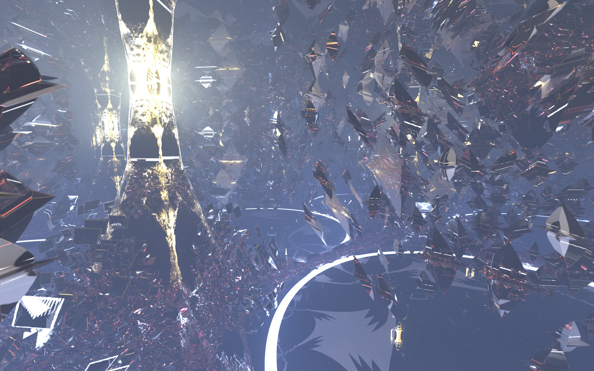

# StochasticRayTrace
My Stochastic Ray Tracer made using Shadertoy

This is a stochastic ray tracer made from scratch using Shadertoy. To use it, you'll have to go to Shadertoy.com and start a new shader and then copy these files into their respective tabs.

